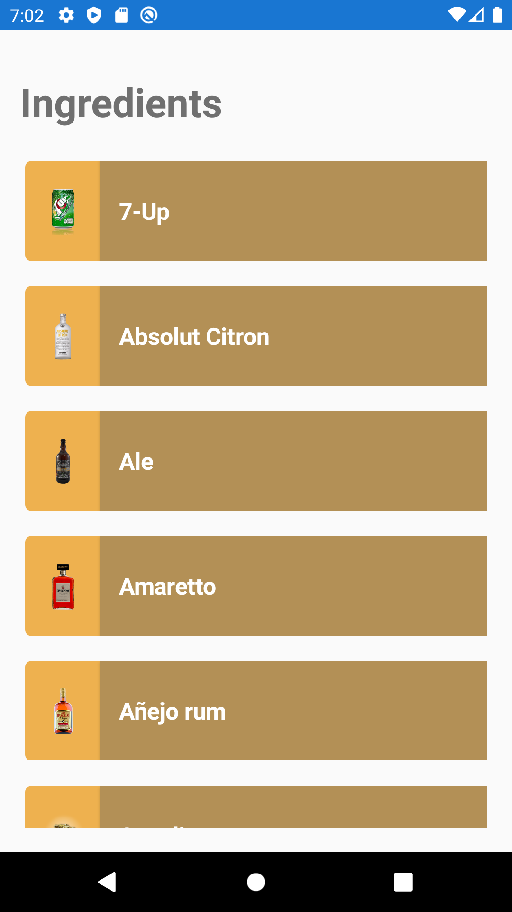

# Xamarin_CocktailDBAPI_Sample
Sample Xamarin Forms Project that retrieves data from TheCocktailDB API and presents it in a listview

## Api Utilizado: TheCocktailDB (https://www.thecocktaildb.com/api.php)
## EndPoint Utilizado: https://www.thecocktaildb.com/api/json/v1/1/list.php?i=list

### Android Visuals (Pixel 2):

#### Ingredient List Page

### iOS Visuals (iPhone 11):

#### Ingredient List Page

